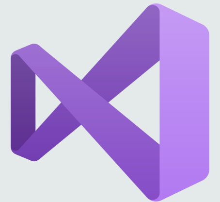
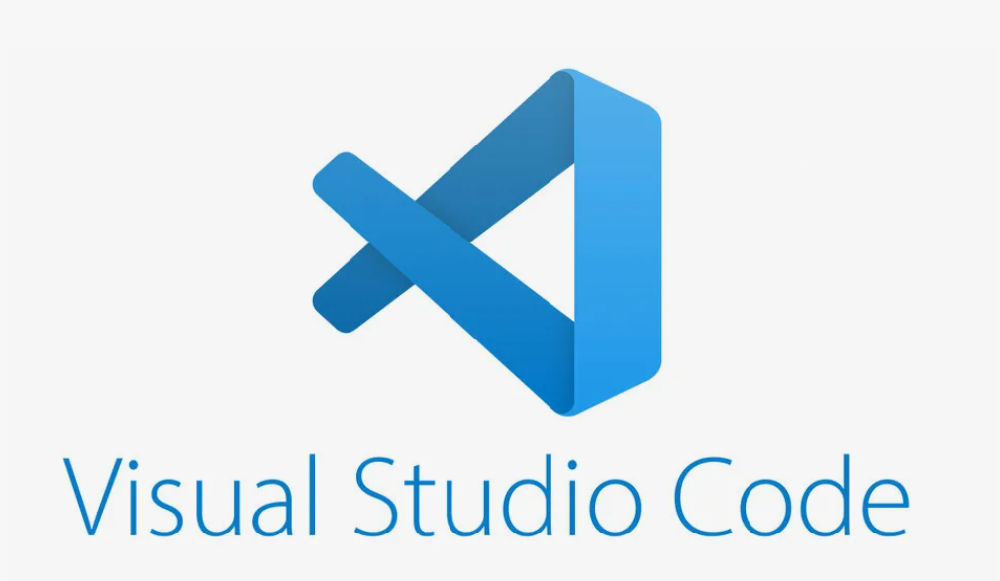

IDE и редакторы кода
~~~~~~~~~~~~~~~~~~~~~

IDE (Integrated Development Environment) и редактор кода – это виды программного обеспечения, предназначенные для работы над приложениями, их разработки и тестирования.

Редактор кода является программой, работающей как текстовый редактор, только более подходящий для написания кода. 

IDE  – это ПО, которое объединяет инструменты для разработки приложений и их тестирования в едином интерфейсе. IDE отличается от редактора, предоставляя более расширенные функции. Среды разработки дают возможность создавать крупные проекты, а также подключать Git.  Как правило, IDE состоит из:

- самого текстового редактора для написания и редактирования кода;

- компилятора – инструмента, позволяющего перевести текст, написанный на языке программирования, в набор машинных кодов;

- отладчика, проверяющего код и устраняющего в нем ошибки;

- инструментов для автоматизации сборки кода, ускоряющих процесс разработки.

Многие IDE позволяют настраивать дополнительные фреймворки и библиотеки для расширения возможностей разработки.

Популярные IDE
""""""""""""""

**Visual Studio**
--------------------

Продукт Microsoft, поэтому ее часто используют для разработки под Windows, хотя среда позволяет писать код и под другие ОС. Она включает в себя не только редактор кода, но и редактор графического интерфейса: в нем можно «собирать» визуальный облик программы из готовых компонентов, как из кубиков.

VS — проприетарный продукт с закрытым исходным кодом. Написана она на C++ и C#. Существует бесплатная версия Community и платные Professional и Enterprise для коммерческой разработки.

**Visual Studio Code (VS Code)**
---------------------------------

Текстовый редактор, разработанный Microsoft для Windows, Linux и macOS. Позиционируется как «лёгкий» редактор кода для кроссплатформенной разработки веб- и облачных приложений. Включает в себя отладчик, инструменты для работы с Git, подсветку синтаксиса. Имеет широкие возможности для кастомизации: пользовательские темы, сочетания клавиш и файлы конфигурации. Распространяется бесплатно, разрабатывается как программное обеспечение с открытым исходным кодом, готовые сборки распространяются под проприетарной лицензией/

С VS Code работают программисты на разных языках. Например, им активно пользуются веб-разработчики, пишущие на HTML/CSS, JavaScript, PHP. Но редактор поддерживает намного большее количество языков: Python, Go, Ruby, C#, TypeScript и так далее. Он работает и с расширениями и фреймворками для популярных языков — например, с React JS и Vue.js, с языками стилей SCSS и LESS, которые дополняют CSS.

В теории пользоваться VS Code может разработчик практически на любом из современных языков. Но на практике его применяют там, где не нужны мощности полноценной IDE.

**Контроль версий**

VS Code поддерживает систему контроля версий Git. Прямо из редактора можно закоммитить изменения или откатить коммит, добавить к нему комментарий или отправить в удаленный репозиторий. Все делается через визуальный интерфейс.

**Установка дополнений**

Одна из особенностей VS Code — он очень легко расширяется. Прямо из редактора можно перейти в каталог расширений и дополнений, найти в поиске то, что необходимо, и установить. Так подключаются поддержка других языков, плагины для автоматического исправления, конфигураторы и много чего еще. Благодаря легкой расширяемости VS Code можно полностью настроить под себя и свои нужды.

**Запуск кода**

Изначально редактор позволяет запускать код только для малого количества языков. Но имеются ополнения, которые открывают такую возможность и для других. Чтобы воспользоваться ей, нужно установить соответствующее расширение и перезагрузить VS Code. После этого в интерфейсе редактора должны появиться кнопки для сборки и запуска. Кстати, изначально в нем есть целая вкладка под названием «Запуск и отладка».

PyCharm
----------

IDE для разработки на Python, созданная JetBrains — разработчиками IntelliJ IDEA. Кроме Python, она поддерживает веб-разработку на Django. Является оптимальным вариантом для новичков, которые пишут на Python. В ней удобная поддержка автотестирования, отладки и других возможностей, а расширения и библиотеки для языка можно устанавливать, не выходя из редактора. IDE кроссплатформенная, существует для Windows, Linux и macOS.
Существует две версии: *Community* и *Professional*. Первая версия бесплатная и свободная, вторая — проприетарная и платная, предназначенная для коммерческой разработки.

**Преимущества:**

- автозавершение кода, автопоиск и исправление ошибок в коде;
- поддержка сред для веб-разработки Django, Flask, Google App Engine, Pyramid и web2py;
- интеграция с системами контроля версий;
- интеграция с Jupyter Notebook, Anaconda и другими библиотеками;
- отладчик, профилировщик Python, встроенные терминал и инструменты баз данных.

**Недостатки:**

- версия Community не поддерживает многие инструменты, нет профилировщика Python и поддержки баз данных;

