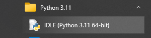
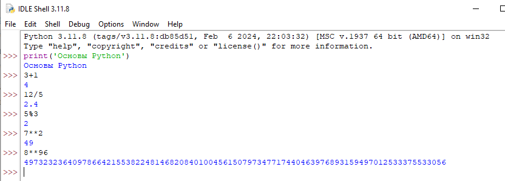
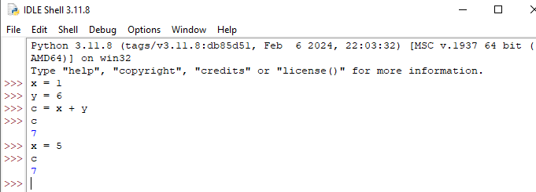

IDLE
~~~~~~~~~

В состав базовой версии Python входят следующие компоненты:

- IDLE – простая среда разработки Python-программ;

- документация – инструкция по использованию Python;

- стандартная библиотека – набор функций, которые упрощают работу с числами, файлами, API сторонних сервисов и так далее;

- пакетный менеджер PIP – утилита для скачивания и установки библиотек, фреймворков и других пакетов, расширяющих функциональность Python;

- стандартный набор тестов – чтобы проверять надёжность программы;

- Python Launcher – приложение для запуска программ с расширением .py

**IDLE** (Integrated Development and Learning Environment) — это интегрированная среда для разработки (и обучения), которая поставляется вместе с Python. По сути это текстовый редактор с подсветкой синтаксиса, автозаполнением, умным отступом и другими функциями для удобства написания кода на Python.

IDLE в Windows находится в меню "Пуск" → "Python 3.x" → "IDLE". Также можно быстро найти его через "Поиск" около меню "Пуск", набрав в поле поиска "IDLE":

Прграмма запускается в интерактивном режиме, который используется для быстрой проверки кода и обучения языку. Написанный в нём код сразу же выполняется, без сохранения в файл.
Открывшееся окно будет похоже на терминал или командную строку. Набранный код можно сразу же запустить для получения результата:

Интерактивный режим также называется Python **REPL** (read-eval-print loop): read — интерпретатор считывает команды, eval — выполняет их, print — выводит результат, loop — повторяет этот цикл.

Но в некоторых случаях он может быть полезен:

- Быстрое тестирование работоспособности кода. IDLE удобно использовать для проверки выражений и функций.
- Обучение программированию на Python. В IDLE можно быстро вводить команды, не думая о создании и сохранении файлов программы.
- Пошаговое выполнение кода для просмотра изменений в значениях переменных и поиска ошибок.
- Проверка работоспособности и тестирование библиотек и модулей до их внедрения в приложение. Можно загрузить свой проект, импортировать новые библиотеки и посмотреть на их сочетаемость и возникающие ошибки.

В примерах использовались константы:

**Константа** – это лексема (последовательность символов), представляющая собой изображение фиксированного числового, строкового или символьного значения

**Переменная** – это именованная величина, значение которой в ходе работы программы может изменяться.

Переменная в Python - это на объект в памяти. При создании любой переменной в неё записывается ссылка на конкретный объект, а сам объект находится в оперативной памяти. Таким образом, несколько переменных могут указывать на один и тот же объект, и при изменении объекта изменится результат обращения к нему с использованием каждой переменной.

https://pythonchik.ru/osnovy/python-idle

https://skillbox.ru/media/code/osnovy-idle-v-python-ot-zapuska-do-pervoy-programmy/

