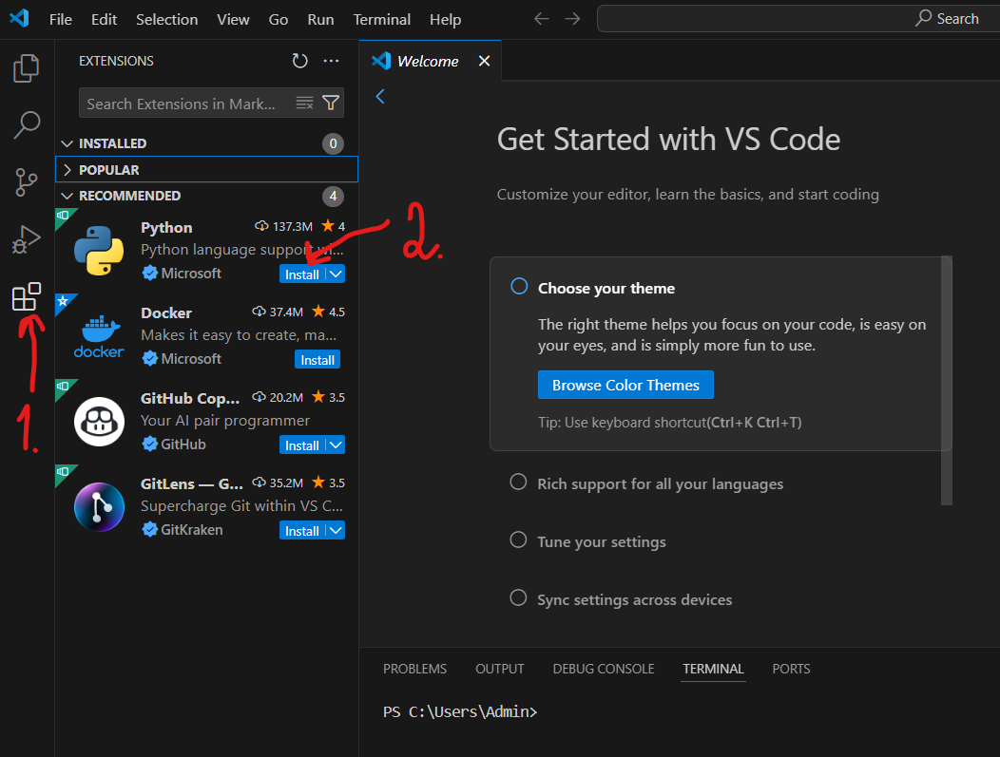
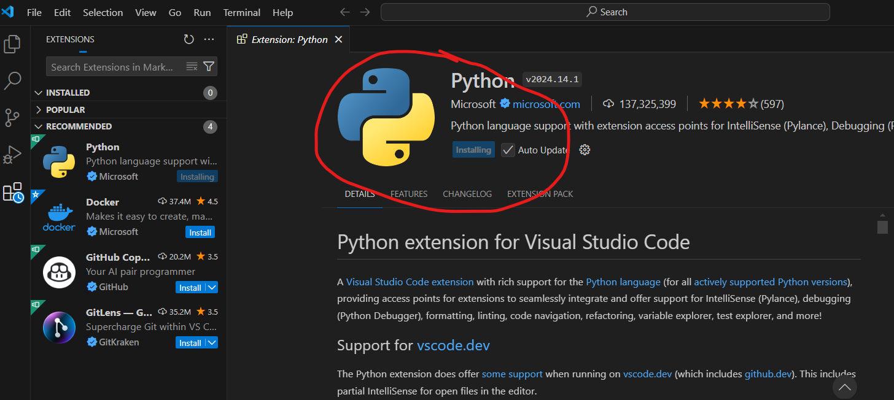
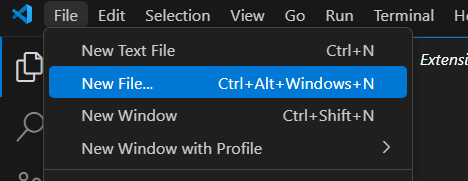
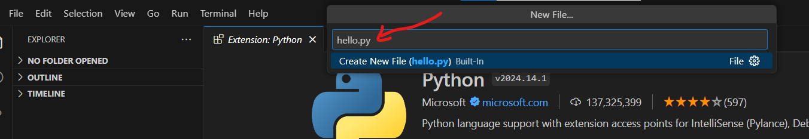
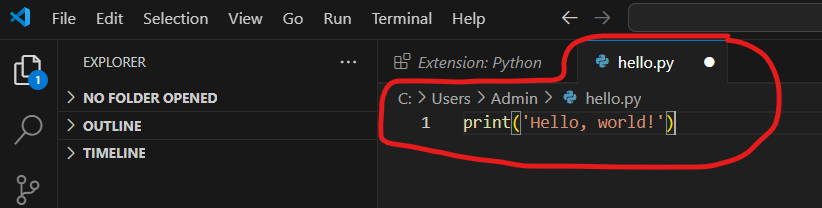
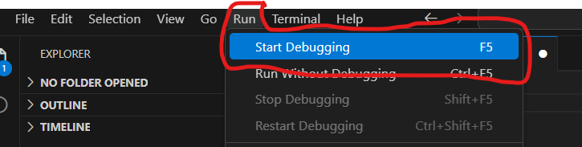
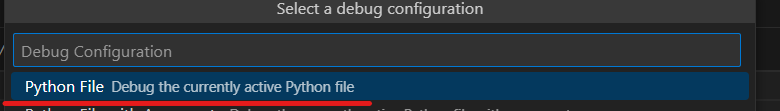

Visual Studio Code
~~~~~~~~~~~~~~~~~~

Установка
""""""""""

1. Скачать `Visual Studio Code <https://code.visualstudio.com/>`__
2. Открыть скачанный файл и установить программу. 
3. Запустить программу (ярлык на Рабочем столе, либо Пуск->VisualStudioCode, либо в строке поиска ввести **VSC**)
4. В окне программы кликнуть по кнопке **Extensions(Расширения)** (рис. VSC_01, 1)
5. В списке расширениий выбрать Python (рис. VSC_01, 2)

Создание первой программы в VSC
""""""""""""""""""""""""""""""""

1. В меню выбрать **File->New file**

   
2. Ввести имя файла и рамширение **hello.py**

   
   
3. Выбрать папку для созранения и нажать **Create**
4. Ввести текст программы

::

        print('Hello? world!')

5. Запустить программу (F5 или Run => Start debugging)

6. Результат выполнения

