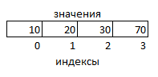

Ветвление
~~~~~~

**Ветвление** - это такая форма организации действий, при которой программа выполняется по одной из возможных ветвей в результате проверки условия.

Условные операторы в Python используют для разработки программ, которые учитывают разные условия и на их основе выполняют определённые действия. 
Чаще всего их используют для следующих задач:

- Принятие решений. Позволяют программе выбирать между различными путями выполнения. Например, отправить пользователю письмо на почту или сообщение в мессенджере.
- Контроль потока выполнения. Условные операторы управляют тем, какие части кода будут выполнены, а какие проигнорированы.
- Оптимизация кода. Позволяют избегать выполнения ненужных операций, что улучшает производительность. Действия в программе выполняются последовательно, но иногда некоторые операции надо пропустить.
- Обработка ошибок. Условные операторы помогают обнаруживать и реагировать на ошибки или нестандартные ситуации. С помощью условных операторов можно описать, как программе реагировать на возникающие в коде ошибки.

Условным оператором в языкях программирования является **if**


if...else
""""""""""""

**Полная форма ветвления**

.. code:: python
 
	if условие:
	    блок_операторов1
	else:
	    блок_операторов2
		
Блок_операторов1 выполняется, если **условие** принимает значение **True**(Истина).  В противном случае (условие равно **False**) выполнется  блок_операторов2

В качестве условия используется логическое выражение. Оно может быть простым и сложным (составным). 

В простом условии сравниваются два операнда. Операции сравнения:

== равно

!= не равно

> больше

>= больше или равно

< меньше

<= меньше или равно

.. important:: Равенство проверяется двойным **==**. Одинарный знак равенства - это присваивание

.. code:: python

	print(2 + 2 == 4)
	
	True
	
.. code:: python

	print(2 + 2 = 4)
	
	Cell In[10], line 1
    print(2 + 2 = 4)
          ^
	SyntaxError: expression cannot contain assignment, perhaps you meant "=="?


Сложные условия состоят из простых, связанных между собой логическими операторами **and**, **or**, **not**

При записи необходимо соблюдать синтаксические правила:
- после условия ставится двоеточие;
- вложенность операторов выполняется путем вставки отступов. Отступ - это **4 пробела** или **Tab**. 
Нежелательно в одной программе сочетать эти варианты простановки отступов.

Примеры:

.. code:: python

	a = 33
	b = 200
	if b >= a:
	    print(f'b больше a')
	else:
	    print(f'b не больше a')
		
	b больше a

В Python вложенность операторов выполняется путем вставки отступов. 
Отступ - это **4 пробела** или **Tab**. Нежелательно в одной программе сочетать эти варианты простановки отступов.

**Неполная форма ветвления**

.. code:: python
 
	if условие:
	    блок_операторов1

.. code:: python

	a = 33
	b = 20
	if b >= a:
	    print(f'b больше a')
	print('Ветвление закончено')
	
	Ветвление закончено
	
В данном случае условие приняло значение **False**, но ветка **else** отсутсвует, поэтому управление сразу передано инструкции, следующей за ветвлением.


if...elif...else
"""""""""""""""""

Данная конструкция  используется для проверки нескольких условий и выполнения только подходящего блока операторов:

if — проверяет первое условие.
elif (сокращение от else if) — проверяет следующие условия, если предыдущее условие ложно.
else — выполняет блок кода, если все предыдущие условия ложны.

Синтаксис:

.. code:: python

	if условие1:
		блок_кода1
	elif условие2:
		блок_кода2
	elif условие3:
		блок_кода3
	else:
		блок_кодаN

.. code:: python

	a = 9

	if a == 10:
		print('a равно 10')
	elif a < 10:
		print('a меньше 10')
	else:
		print('a больше 10')

	a меньше 10
	
.. code:: python

	# Запрос фамилии
	last_name = input('Введите фамилию')
	
	# Взять окончание - два символа справа
	end_fam = last_name[-2:]
	
	if end_fam == 'ов':
		print('Вы мужского пола')
	elif end_fam == 'ий':
		print('Вы мужского пола')
	elif end_fam == 'ва':
		print('Вы женского пола')
	elif end_fam == 'ая':
		print('Вы женского пола')
	else:
		print('Программа находится в режиме отладки. Еще не все фамилии проанализированы')

	Введите фамилию: Сидоров
	Вы мужского пола
	
	Введите фамилию: Васильева
	Вы женского пола
	
	Введите фамилию: Васильев
	Программа находится в режиме отладки. Еще не все фамилии проанализированы
	
	
онструкция if построена на условиях: после if и elif всегда пишется условие. Блоки if/elif выполняются только когда условие возвращает True, поэтому первое с чем надо разобраться - это что является истинным, а что ложным в Python.

True и False
"""""""""""""

В Python, кроме очевидных значений True и False, всем остальным объектам также соответствует ложное или истинное значение:

**истинное значение:**

- любое ненулевое число 

- любая непустая строка

- любой непустой объект 


**ложное значение:**

- 0

- None

- пустая строка

- пустой объект

Примеры:

.. code:: python

	my_list = [1,2]
	if my_list:
		print(True)
	else:
		print(False)

	True
	
.. code:: python
	
	my_list = [[]]
	if my_list:
		print(True)
	else:
		print(False)

	True

Здесь **my_list = [[]]** - создан список, содержащий пустой список. То есть my_list сам пустым не является. 

.. code:: python

	my_list = []
	if my_list:
		print(True)
	else:
		print(False)
		
	False

Логические операторы
""""""""""""""""""""""

Используются для работы с булевыми значениями **True** и **False**

**and**

Результат операции принимает значение одного из операндов, если **оба** операнда являются **True**, то будет возвращен последний операнд.

Если есть один False, то будет возвращен первый False

.. figure:: img/01_if_01.PNG
       :scale: 100 %
       :align: center
       :alt: asda

.. note:: Особенностью работы оператора **and** является то, что операнды, которые находятся после ложного, не вычисляются.

**or**

Результат операции принимает значение одного из операндов, если **оба** операнда являются **True**, то будет возвращен первый операнд. 

**False** возвращается, если все операнды **False** 

.. figure:: img/01_if_02.PNG
       :scale: 100 %
       :align: center
       :alt: asda

.. note:: Особенностью работы оператора **or** является то, что операнды, которые находятся после истинного, не вычисляются.

Указанные особенности полезны при составлении логики проверки. Для повышения эффективности программ.

**not**

Принимает значение True, если применяется к операнду, имеющему значение False и наоборот.

.. figure:: img/01_if_02.PNG
       :scale: 100 %
       :align: center
       :alt: asda
	   
 


Оператор in
""""""""""""

Оператор in выполняет проверку на наличие элемента в последовательности (например, элемента в списке или подстроки в строке):

.. code:: python

        my_val = 10
		list1 = [10, 20, 30, 77]
		if my_val in list1:
		    print(True)
		else:
		print(False)
		
		True
		
.. code:: python

        my_str = 'full'
		string1 = 'List is empty'
		print(my_str in string1)
		
		False
        


Примеры списков:

.. code:: python

        list1 = [10, 20, 30, 77]
        list2 = ['one', 'dog', 'seven']
        list3 = [1, 20, 4.0, 'word']

Каждый элемент списка имеет свой **индекс**.




Индексы элементов начинаются с **нуля**

Отличительной особенностью списков являются **квадратные скобки []**


Создание списка
````````````````

**Перечисление**

summ_days = [1000, 2000, 2500, 3500]

**Пустой спиcок**

employeers = []

managers = list()

Так как списки являются последовательностями, то к ним применимы все операции, применимые к последовательностям, например, строкам.

**Создание списка разбиением строки**

.. code:: python

        str1 = 'Мама мыла раму'
        list_str1 = str1.split()
        print(list_str1)

Результат:

['Мама', 'мыла', 'раму']

**Создание списка из строки**

.. code:: python

        str1 = 'Мама'
        list_str1 = list(str1)
        print(list_str1)

Результат:

['М', 'а', 'м', 'а']


Доступ к элементу
````````````````````
Доступ к элементу осуществляется указанием имени списка и индекса, заключенного в квадратные скобки

**list1[1]**


.. code:: python

        list1 = [10, 20, 30, 77]
        # печать списка
        print(list1)
        # Печать первого элемента
        print(list[1])

Результат:

[10, 20, 30, 77]

20

Длина списка
`````````````
**len(имя_списка)**

.. code:: python

        list1 = [10, 20, 30, 77]
        # Печать длины списка
        print(len(list1))

Результат:

4

Взятие среза
`````````````

.. code:: python

        list1 = [10, 20, 30, 77]
        # Печать длины списка
        part1 = list1[:2]
        print(part1)

Результат:

[10, 20]


Объединение списков
`````````````````

.. code:: python

        # Создание и печать пустого списка
        managers = list()
        print(managers)
        # Сложение списков
        managers = managers + ['Иванов', 'Петров', 'Сидоров']
        # вывод списка
        print(managers)
        # вывод типа объекта
        print(type(managers))

Результат:

[]

['Иванов', 'Петров', 'Сидоров']

<class 'list'>


Изменение списка
```````````````````

Так как список является изменяемой последовательностью, то его можно изменять без создания нового объекта

.. code:: python

        list1 = [10, 20, 30, 77]
        print(list1)
        list1[0] = 5
        print(list1)


Результат:

[10, 20, 30, 77]

[5, 20, 30, 77]


Распаковка списка
``````````````````

.. code:: python

        a, b, c, d = [10, 20, 30, 77]
        print(a)
        print(b)
        print(c)
        print(d)

Результат:

10

20

30

77

Встроенные функции для списков Python
"""""""""""""""""""""""""""""""""""""""


sorted()
`````````

Возвращает отсортированный список:

.. code:: python

        a = [8, 1, 3, 2]
        sorted(a) # [1, 2, 3, 8]
        
min() и max()
````````````````

Возвращают наименьший и наибольший элемент списка:

.. code:: python

        a = [1, 9, -2, 3]
        min(a) # -2
        max(a) # 9


.. toctree::
   :maxdepth: 1
   :hidden:

   list_methods
   list_examples
