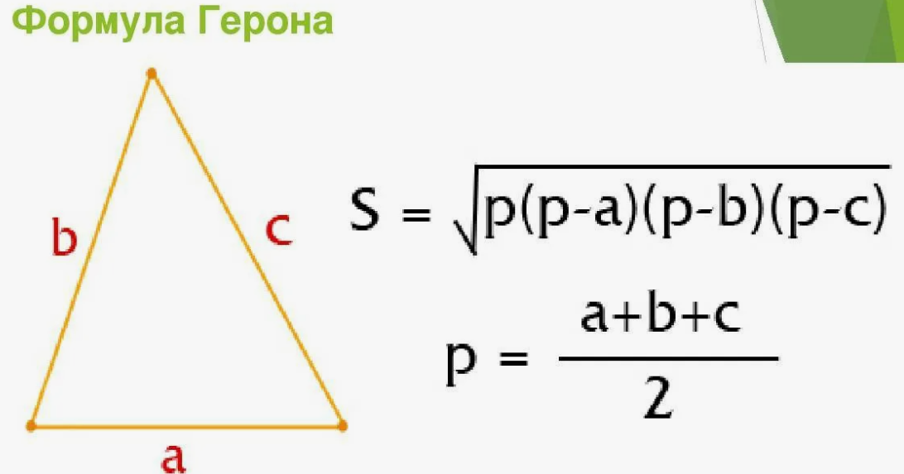

Примеры работы с условными операторами
~~~~~~~~~~~~~~~~~~~~~~~~~~~~~~~~~~~~~~~

Пример 1:

Даны стороны треугольника a,b,c. Составить программу вычисления площади труегольника по формуле Герона:

Пример 2:

Создать скрипт проверки ввода пароля.

.. code:: python
	
	password = input('Введите пароль')
	if password == 'P@ssw0rd':
		print('Successful')
	else:
		print('Access denied!')
		
Пример 3:

Дополнить предыдущий скрипт проверки ввода имени пользователя и  пароля

.. code:: python
	
	list_users = ['admin', 'manager', 'anykey', '']
	
	password = input('Введите пароль')
	if password == 'P@ssw0rd':
		print('Successful')
	else:
		print('Access denied!')

