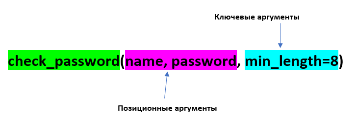

Функции пользователя
~~~~~~~~~~~~~~~~~~~~~

Создание функции
"""""""""""""""""""


    

Фунцкция создается с помощью ключевого слова **def**.

Сразу после def идет **имя функции**, а после него в круглых скобках должны находиться **параметры** для работы этой функции. Функция может не иметь параметров.

Определение функции
````````````````````````

.. code:: python

	def say_hello():
		print("Hello, World!")

Вызов функции
``````````````
.. code:: python

	say_hello()

Инструкция return 
``````````````````

**return** используется в теле функции, если нужно вернуть какое-то значение. Если инструкции **return** нет, тогда по умолчанию функция будет возвращать объект **None**. Как в этом примере:

# Определение функции
def sum_numbers(a,b):
    sum = a + b

print(sum_numbers(1,2))

Добавление return

# Определение функции
def sum_numbers(a,b):
    sum = a + b
    return sum

print(f'Сумма чисел равна {sum_numbers(1,2)}')

<div class="alert alert-danger">
    
ВАЖНО: Функция выполняется до первого **return**. 

Инструкции, описанные после **return**, не выполняются.
</div>

# Определение функции
def sum_numbers(a,b):
    sum = a + b
    return sum
    print('Функция выполнена!!!\n')

print(f'Сумма чисел равна {sum_numbers(1,2)}')

# Определение функции
def sum_numbers(a,b):
    sum = a + b
    print('Функция выполнена!!!\n')
    return sum

print(f'Сумма чисел равна {sum_numbers(1,2)}')

#### Возврат нескольких значений

Если после оператора **return** указать несколько значений, то они будут возвращены в точку вызова функции в виде кортежа:

# Определение функции
def sum_numbers(a,b):
    sum = a + b
    return a, b, sum

result = sum_numbers(5,7)

print(result)

#### Високосный год

Написать скрипт для определения "високосности" года. Год является високосным, если его значение кратно 4 и не кратно 100 или кратно 400

def is_leap_year(year):
    if (year % 4 == 0 and year % 100 != 0) or year % 400 == 0:
      return True
    else:
      return False

# Ввод данных
my_year = int(input('Введите год: '))

# Функция вызывается и её результат проверяется if
if is_leap_year(my_year):
    print(f'{my_year} - високосный год')
else:
    print(f'{my_year} - не високосный год')


После ввода номер года, он записывается в переменную **my_year**. Далее, эта переменная в качестве аргумента передается функции **is_leap_year** и там записывается в параметр **year**. Это значение проверяется в функции в операторе **if**. В зависимости от истинности этого условия в точку вызова программы возвращается результат. И на основании этого результата уже в основной функции печатается в консоль результат проверки.

Более лаконичный вариант функции:

def is_leap_year(year):
    return (year % 4 == 0 and year % 100 != 0) or year % 400 == 0

### Документация (docstring)
Первая строка в определении функции - это docstring, строка документации. Это комментарий, который используется как описание функции:

def is_leap_year(year):
    """
    Функция определения високосности года
    """
    return (year % 4 == 0 and year % 100 != 0) or year % 400 == 0

is_leap_year?


is_leap_year.__doc__

Документация позволяет понять, как работает функция, если ее используют другие специалисты.

## Параметры функции

Параметры функции бывают:
- **Обязательные**;
- **Необязательные** (опциональные, со значением по умолчанию).

### Обязательные параметры

Обязательные параметры определяют, какие аргументы нужно передать функции обязательно. При этом, количество аргументов при вызове функции должно быть **ровно** таким, сколько указано параметров функции.

def print_names(name1, name2):
    print(name1)
    print(name2)

print_names('Михаил','Валентина')

print_names('Зоя')

В данном случае фунция ожидает 2 аргумента, а ей передан один.

### Необязательные параметры (параметры со значением по умолчанию)

Значение необязательного параметра указывается при определении функции и подставляется автоматически при ее вызове.

Для необязательного параметра нет необходимости указывать значение аргумента при вызове функции.

def check_passwd(username, password, min_length=8):
    """
    Функция проверки ппароля на соответствие требованиям, устанавливаемым к паролям
    """
    if len(password) < min_length:
        print('Пароль слишком короткий')
        return False
    elif username in password:
        print('Пароль содержит имя пользователя')
        return False
    else:
        print(f'Пароль для пользователя {username} прошел все проверки')
        return True

# Вызов функции без указания min_lendth
check_passwd('mike', '2345')

При работе функции было подставлен значение **min_length**, равное 8, как в определении функции 

# Вызов функции с указанием min_lendth
check_passwd('mike', '2345', 3)

При работе функции c таким набором параметров было подставлено значение min_length, равное 3.

Значение по умолчанию оценивается и сохраняется только один раз при определении функции (не при вызове). Следовательно, если значение по умолчанию — это изменяемый объект, например, список или словарь, он будет меняться каждый раз при вызове функции. Чтобы избежать такого поведения, инициализацию нужно проводить внутри функции или использовать неизменяемый объект:


## Аргументы функции

Аргументы функции бывают:
- **Позиционные**  передаются в том же порядке, в котором они определены при создании функции. То есть, порядок передачи аргументов определяет, какое значение получит каждый аргумент;
- **Ключевые** - передаются с указанием имени аргумента и его значения. Так как их имя указывается явно, то таком случае, аргументы могут быть указаны в любом порядке.


При вызове функции с испльзованием и позиционных и ключевых агрументов первыми передаются позиционные

# Вызов функции с указанием ключевого аргумента после позиционных
check_passwd('mike', '2345', min_length=3)

# Вызов функции с указанием ключевого аргумента перед позиционными
check_passwd(min_length=3, 'mike', '2345')


### Позиционные аргументы

Для данных параметров важна позиция, в которой они описаны в функции. Если параметр описан первым, то и при при вызове функции аргумент, переданный первым будет записан в него, второй - во второй и так далее. 

def print_names(name1, name2):
    print(name1)
    print(name2)

print_names('Михаил','Валентина')

print_names('Валентина','Михаил')

<div class="alert alert-danger"> 
 
**Количество аргументов должно совпадать с количеством параметров:**  
    
</dev>

print_names('Зоя')

<div class="alert alert-danger"> 
 
**Порядок важен, так как нарушается логика работы программного кода внутри функции**  
    
</dev>

def calculate_fraction(x, y):
    return x/(1-y)

calculate_fraction(1,2)

calculate_fraction(2,1)

Во втором случае значение **1** записалось в переменную **y** и при подстановке в дробь олучился 0, а на 0 делить нельзя -> ошибка.

#### Произвольное количество позиционных аргументов, *args

В тех случаях, когда заранее неизвестно  количество аргументов передаваемых функцию, необходимо добавить символ * перед именем параметра в определении функции. Таким образом, функция получит набор аргументов и сможет соответствующим образом обращаться к элементам.

Обычно данный параметр записывают <b>*args</b>

<b>*args</b> - ожидает аргументы переменной длины (при каждом вызове могут быть разными)

def accept_patients(doctor, *args):
    print(f'Список пациентов для доктора {doctor}:')
    print('-'*20)
    for el in args:
        print(el)

accept_patients("Пархоменко","Васильев", "Петрова", "Лопатин")

accept_patients("Николаев","Иванов", "Слепов", "Вакутагин","Кошкин")

def accept_patients(*args,doctor):
    print(f'Список пациентов для доктора {doctor}:')
    print('-'*20)
    for el in args:
        print(el)

accept_patients("Пархоменко","Васильев", "Петрова", "Лопатин")

**Python обрабатывает позиционные аргументы следующим образом:**

подставляет обычные позиционные аргументы слева направо, а затем помещает остальные позиционные аргументы в кортеж (*args)

В приведенном примере все элементы были **захвачены** в args и на долю параметра doctor аргументов на хватило. Требуется явно указывать ключевой параметр doctor и передавать значения.

#### Передача только позиционных аргументов

Если требуется передавать в функцию аргументы **ТОЛЬКО** как позиционные, то при определении функции после всех позиционных параметров требуется указать символ **слэш** **/**

def calculate_fraction(x, y,/):
    return x/(1-y)

calculate_fraction(1,2)

calculate_fraction(1,y=2)

Здесь ошибка возникла, потому что указано **y=2** (ключевой аргумент), а это запрещено в определении функции.


### Ключевые аргументы

- передаются с указанием имени аргумента

- могут передаваться в любом порядке


Если указать имена параметров для всех аргументов, то можно вызывать функцию, расположив аргументы в любом порядке:

check_passwd(min_length=3, username='mike', password='2345')

В приведенном примере все аргументы были переданы, как в ключевые.

#### Передача только ключевых аргументов

Если требуется передавать в функцию аргументы **ТОЛЬКО** как **КЮЧЕВЫЕ**, то при определении функции после **ПЕРЕД** этими параметрами требуется указать символ звездочка <b>*</b>

def calculate_fraction(*,x, y):
    return x/(1-y)

Так вызвать уже нельзя

calculate_fraction(1,2)

Можно только так:

calculate_fraction(y=2,x=1)

#### Произвольное количество аргументов-ключевых слов **kwargs

Как и в случае с позиционными аргументами можно определять произвольное количество аргументов-ключевых. Параметр, который принимает ключевые аргументы переменной длины, создается добавлением перед именем параметра двух звездочек. Имя параметра может быть любым, чаще всего, используют имя <b>**kwargs</b> (от keyword arguments).

def sum_arg(a, **kwargs):
    print(a, kwargs)
    return a + sum(kwargs.values())

sum_arg(a=10, b=10, c=20, d=30)

Функция sum_arg создана с двумя параметрами:

- параметр a (если передается как позиционный аргумент, должен идти первым, если передается как ключевой аргумент, то порядок не важен)

- параметр <b>**kwargs</b> - ожидает ключевые аргументы переменной длины, куда попадут все остальные ключевые аргументы в виде словаря. Эти аргументы могут отсутствовать

sum_arg(a=10, b=10, c=20, d=30, k=12, e=-10)

sum_arg(10)

### Комбинация позиционных и ключевых элементов

Можно комбинировать два типа аргументов в одной и той же функции.

Любой аргумент перед символом / предназначен только для позиционных аргументов, а любой аргумент после символа * - только для ключевых слов.

def my_function(a, b, /, *, c, d):
  print(a + b + c + d)

my_function(5, 6, c = 7, d = 8)

my_function(5, c = 7, d = 8, 6)

**Ошибка:** позиционный аргумент **6** записан после ключевых

## Анонимная функция: лямбда

Лямбда-функция — это короткая однострочная функция, которой не имеет имени. 

Лямбда-функция может принимать любое количество аргументов, но может содержать только одно выражение.

Такие выражения содержат лишь одну инструкцию, поэтому, например, if, for и while использовать нельзя. 

Синтаксис:

<b>lambda</b> <em>arguments<em> : <em>expression<em>

# Добавить значение 10 к аргументу и вернуть результат

x = lambda a : a + 10
print(x(5))

Функция является объектом, поэтому можно ее присвоить какой-нибудь переменной. В данном случае x. При вызове x c аргументом 5 данное значение записывается в параметр a и будет срабатывать иструкция 5 + 10. Возвращен результат 15.

# Перемножить аргументы a и b и вернуть результат

x = lambda a, b : a * b
print(x(5, 6))

Создать lambda-функцию, возвращающую первый и последний символ строки 

f = lambda x: x[0] + x[-1]
print(f('Jupyter'))


Ветвление
~~~~~~

**Ветвление** - это такая форма организации действий, при которой программа выполняется по одной из возможных ветвей в результате проверки условия.

Условные операторы в Python используют для разработки программ, которые учитывают разные условия и на их основе выполняют определённые действия. 
Чаще всего их используют для следующих задач:

- Принятие решений. Позволяют программе выбирать между различными путями выполнения. Например, отправить пользователю письмо на почту или сообщение в мессенджере.
- Контроль потока выполнения. Условные операторы управляют тем, какие части кода будут выполнены, а какие проигнорированы.
- Оптимизация кода. Позволяют избегать выполнения ненужных операций, что улучшает производительность. Действия в программе выполняются последовательно, но иногда некоторые операции надо пропустить.
- Обработка ошибок. Условные операторы помогают обнаруживать и реагировать на ошибки или нестандартные ситуации. С помощью условных операторов можно описать, как программе реагировать на возникающие в коде ошибки.

Условным оператором в языкях программирования является **if**

.. figure:: img/01_if_00.png
       :scale: 100 %
       :align: center
       :alt: asda

if...else
""""""""""""

**Полная форма ветвления**

.. code:: python
 
	if условие:
	    блок_операторов1
	else:
	    блок_операторов2
		
Блок_операторов1 выполняется, если **условие** принимает значение **True**(Истина).  В противном случае (условие равно **False**) выполнется  блок_операторов2

В качестве условия используется логическое выражение. Оно может быть простым и сложным (составным). 

В простом условии сравниваются два операнда. Операции сравнения:

== равно

!= не равно

> больше

>= больше или равно

< меньше

<= меньше или равно

.. important:: Равенство проверяется двойным **==**. Одинарный знак равенства - это присваивание

.. code:: python

	print(2 + 2 == 4)
	
	True
	
.. code:: python

	print(2 + 2 = 4)
	
	Cell In[10], line 1
    print(2 + 2 = 4)
          ^
	SyntaxError: expression cannot contain assignment, perhaps you meant "=="?


Сложные условия состоят из простых, связанных между собой логическими операторами **and**, **or**, **not**

При записи необходимо соблюдать синтаксические правила:
- после условия ставится двоеточие;
- вложенность операторов выполняется путем вставки отступов. Отступ - это **4 пробела** или **Tab**. 
Нежелательно в одной программе сочетать эти варианты простановки отступов.

Примеры:

.. code:: python

	a = 33
	b = 200
	if b >= a:
	    print(f'b больше a')
	else:
	    print(f'b не больше a')
		
	b больше a

В Python вложенность операторов выполняется путем вставки отступов. 
Отступ - это **4 пробела** или **Tab**. Нежелательно в одной программе сочетать эти варианты простановки отступов.

**Неполная форма ветвления**

.. code:: python
 
	if условие:
	    блок_операторов1

.. code:: python

	a = 33
	b = 20
	if b >= a:
	    print(f'b больше a')
	print('Ветвление закончено')
	
	Ветвление закончено
	
В данном случае условие приняло значение **False**, но ветка **else** отсутсвует, поэтому управление сразу передано инструкции, следующей за ветвлением.


if...elif...else
"""""""""""""""""

Данная конструкция  используется для проверки нескольких условий и выполнения только подходящего блока операторов:

if — проверяет первое условие.
elif (сокращение от else if) — проверяет следующие условия, если предыдущее условие ложно.
else — выполняет блок кода, если все предыдущие условия ложны.

Синтаксис:

.. code:: python

	if условие1:
		блок_кода1
	elif условие2:
		блок_кода2
	elif условие3:
		блок_кода3
	else:
		блок_кодаN

.. code:: python

	a = 9

	if a == 10:
		print('a равно 10')
	elif a < 10:
		print('a меньше 10')
	else:
		print('a больше 10')

	a меньше 10
	
.. code:: python

	# Запрос фамилии
	last_name = input('Введите фамилию')
	
	# Взять окончание - два символа справа
	end_fam = last_name[-2:]
	
	if end_fam == 'ов':
		print('Вы мужского пола')
	elif end_fam == 'ий':
		print('Вы мужского пола')
	elif end_fam == 'ва':
		print('Вы женского пола')
	elif end_fam == 'ая':
		print('Вы женского пола')
	else:
		print('Программа находится в режиме отладки. Еще не все фамилии проанализированы')

	Введите фамилию: Сидоров
	Вы мужского пола
	
	Введите фамилию: Васильева
	Вы женского пола
	
	Введите фамилию: Васильев
	Программа находится в режиме отладки. Еще не все фамилии проанализированы
	
	
онструкция if построена на условиях: после if и elif всегда пишется условие. Блоки if/elif выполняются только когда условие возвращает True, поэтому первое с чем надо разобраться - это что является истинным, а что ложным в Python.

True и False
"""""""""""""

В Python, кроме очевидных значений True и False, всем остальным объектам также соответствует ложное или истинное значение:

**истинное значение:**

- любое ненулевое число 

- любая непустая строка

- любой непустой объект 


**ложное значение:**

- 0

- None

- пустая строка

- пустой объект

Примеры:

.. code:: python

	my_list = [1,2]
	if my_list:
		print(True)
	else:
		print(False)

	True
	
.. code:: python
	
	my_list = [[]]
	if my_list:
		print(True)
	else:
		print(False)

	True

Здесь **my_list = [[]]** - создан список, содержащий пустой список. То есть my_list сам пустым не является. 

.. code:: python

	my_list = []
	if my_list:
		print(True)
	else:
		print(False)
		
	False

Логические операторы
""""""""""""""""""""""

Используются для работы с булевыми значениями **True** и **False**

**and**

Результат операции принимает значение одного из операндов, если **оба** операнда являются **True**, то будет возвращен последний операнд.

Если есть один False, то будет возвращен первый False

.. figure:: img/01_if_01.png
       :scale: 100 %
       :align: center
       :alt: asda

.. note:: Особенностью работы оператора **and** является то, что операнды, которые находятся после ложного, не вычисляются.

**or**

Результат операции принимает значение одного из операндов, если **оба** операнда являются **True**, то будет возвращен первый операнд. 

**False** возвращается, если все операнды **False** 

.. figure:: img/01_if_02.png
       :scale: 100 %
       :align: center
       :alt: asda

.. note:: Особенностью работы оператора **or** является то, что операнды, которые находятся после истинного, не вычисляются.

Указанные особенности полезны при составлении логики проверки. Для повышения эффективности программ.

**not**

Принимает значение True, если применяется к операнду, имеющему значение False и наоборот.

.. figure:: img/01_if_03.png
       :scale: 100 %
       :align: center
       :alt: asda
	   
 


Оператор in
""""""""""""

Оператор in выполняет проверку на наличие элемента в последовательности (например, элемента в списке или подстроки в строке):

.. code:: python

        my_val = 10
		list1 = [10, 20, 30, 77]
		if my_val in list1:
		    print(True)
		else:
		print(False)
		
		True
		
.. code:: python

        my_str = 'full'
		string1 = 'List is empty'
		print(my_str in string1)
		
		False
        

.. toctree::
   :maxdepth: 1
   :hidden:

   if_examples


