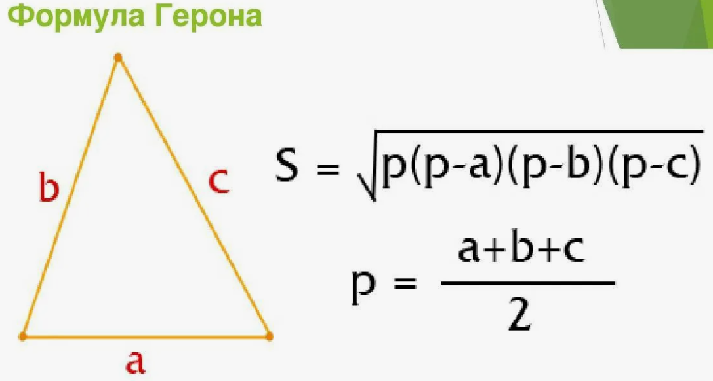

Примеры работы с функциями
~~~~~~~~~~~~~~~~~~~~~~~~~~~~~~~~~~~~~~~

Площадь треугольника
"""""""""""""""""""""""""""""""

Даны стороны треугольника a,b,c. Написать функцию вычисления площади труегольника по формуле Герона:

Площадь треугольника 2
""""""""""""""""""""""""""

Написать функцию, определяющую количество переданных аргументов и вычисляющий площадь треугольника по следующему принципу:

3 аргумента - формула Герона
2 аргумента - половина основания на высоту

**Примечание:** Так как количество параметров будет переменным и неважно, как их именуют, то исполоьзуем *args

Количество букв разных регистров
"""""""""""""""""""""""""""""""""

Напишите функцию Python, которая принимает строку и подсчитывает количество прописных и строчных букв.

Вход: "The quick Brow Fox"

Выход:

Символов в ВЕРХНЕМ регистре : 3

Символов в нижнем регистре : 12

Площадь круга (lambda)
"""""""""""""""""""""""""

Написать функцию lambda для вычисления площади круга произвольного радиуса r

ФИО
""""

ФИО
В файле "сотрудники.txt" приведен спиок сотрудников отдела. 
Написать программу, формирующую новый файл с фамилиями и инициалами сотрудников для сдачи теста по Технике безопасности.

Формирование списка с фамилиями и инициалами выполнить в виде функции.

.. code:: python

	def unpack_list(*args):
		"""
		Функция, формирующая из списка фамилий, имен и отчеств список из фамилий и инициалов
		
		Вход: *args - список переменной длины
		Выход: person2_lst - список из фамилий и инициалов в формате Фамилия И. О.
		"""
		
		# Cписок для Фамилия И. О.
		person2_lst = []
		# Для каждой строки в полученном кортеже повторять:
		for line in args:
			# Распаковать строку в переменные l_n - фамилия, f_n - имя, m_n - отч
			l_n, f_n, m_n = line.split()
			# Добавить в новый список l_n - фамилия, f_n - имя[0], m_n - отч[0]
			person2_lst.append(l_n + ' ' + f_n[0] + '. ' + m_n[0] + '.\n')
		
		# Возврат сформированного списка
		return person2_lst

	with open('сотрудники.txt',encoding='UTF-8') as f:
		lst = f.readlines()

	result = unpack_list(*lst)
	# Печать списка
	print('Готовый список')
	print('-'*20)
		  
	print(result)
	# Печать распакованного списка (извлеченные элементы)
	print('\nРаспакованный список')
	print('-'*20)
	print(*result)
