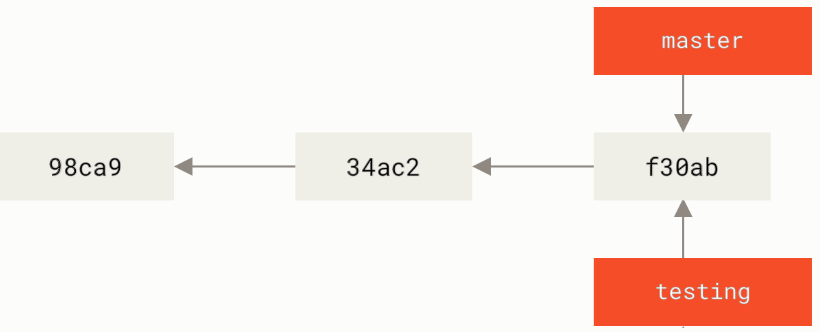
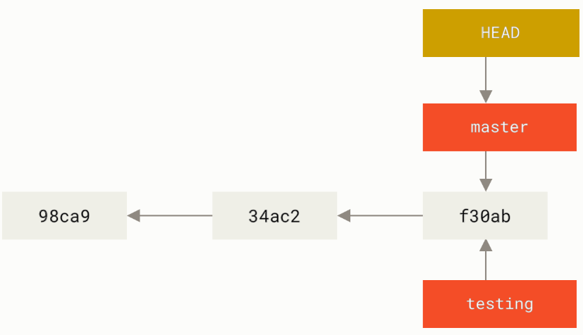
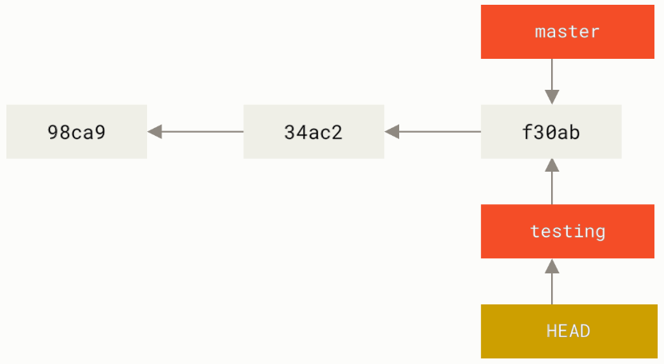
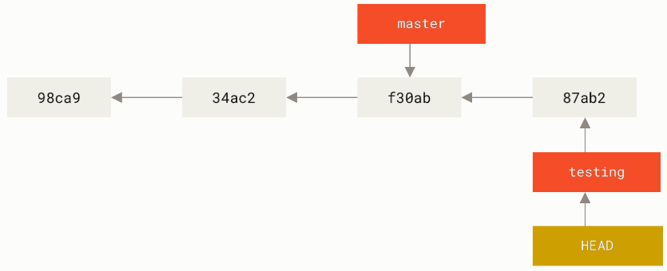
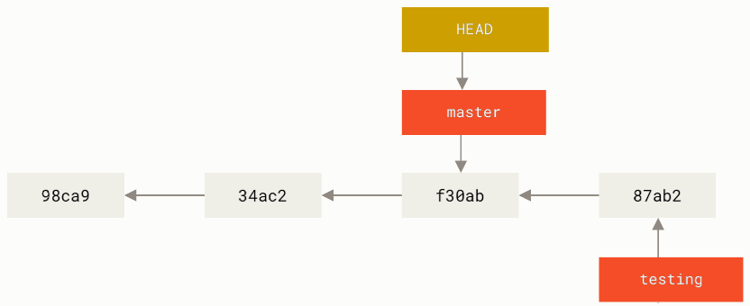

Ветвление в Git
################

Ветвление в Git - это создание новых веток c целью отклонения от основной линии разработки. 

Причины создания могут разными:

* создание и тестирование нового функционала;
* отладка имеющегося кода;

Работа в новой ветке не затрагивает функционирование основной ветки.

Когда выполняется коммит, то Git сохраняет его в виде объекта, который содержит указатель на снимок (snapshot) подготовленных данных. 
Этот объект так же содержит имя автора и email, сообщение и указатель на коммит или коммиты непосредственно предшествующие данному (его родителей).

.. figure:: img/01_git_14.png
       :scale: 100 %
       :align: center
       :alt: asda
	   
Ветка в Git — это простой *перемещаемый указатель* на один из таких коммитов. По умолчанию, имя основной ветки в Git —** master**. В процессе создания коммитов, 
ветка **master** будет всегда указывает на последний коммит, то есть *указатель* ветки **master** будет передвигаться на следующий коммит автоматически.

.. figure:: img/01_git_15.png
       :scale: 100 %
       :align: center
       :alt: История коммитов
	   
Создание новой ветки
*********************

При создании новой ветки создается новый **указатель** на текущий коммит.

.. code::

	git branch testing
	

	   
Для ориентации в ветках Git указатель **HEAD**, который указывает на **ветку**.

Переключение веток
*******************

При создании новой ветки указатель HEAD не перемещается автоматически на новую ветку. 
Для переключения Git на вновь созданную ветку используется команда **checkout**:

.. code::

	git checkout testing
	
После выполнения этой команды HEAD переместится и будет указывать на testing.

	
.. note:: С версии 2.23 появилась команда **switch** для переключения между ветками *git switch testing*
	   
Создание коммита в новой ветке
==============================

После внесения изменений и создания коммита в новой ветке указатель истории состояния сместится вперед. Это будет указатель ветки **testing**, с ним вместе сместится и HEAD.

.. code::

	echo "print('Create new branch')" > hello_git.py
	git commit -m 'Update hello_git.py'

Указатель **master** останется в том месте, где был сделан переход с ветки на ветку. 

.. note:: Для просмотра истории коммитов другой ветки необходимо явно указать её имя: *git log testing*. для просмотра всей истории всех веток: *git log --all*

Переключение на старую ветку
==============================

.. code::

	git checkout master
	
Переключение на старую ветку master приведет к перемещению указателя HEAD и возврату файлов каталога в рабочее состояние в состояние, на снимок которого указывает master.

	   
Визуализация
==============

.. code::

	git log --oneline --decorate --graph --all

Практика:
*********

1. 

	   

	
