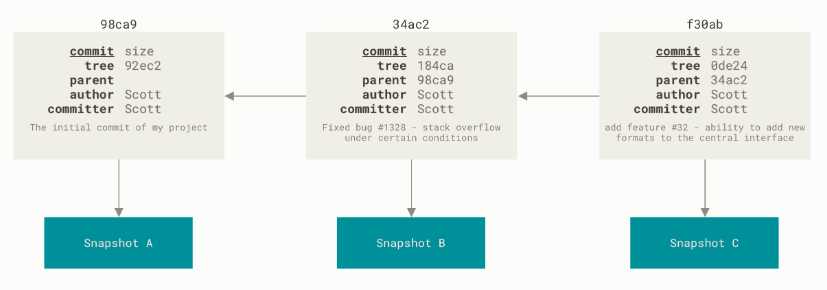
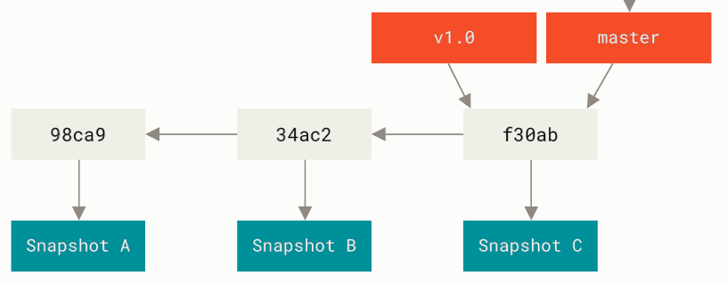

Ветвление в Git
################

Ветвление в Git - это создание новых веток c целью отклонения от основной линии разработки. 

Причины создания могут разными:

* создание и тестирование нового функционала;
* отладка имеющеося кода;

Работа в новой ветке не затрагивает функционирование основной ветки.

Когда выполняется коммит, то Git сохраняет его в виде объекта, который содержит указатель на снимок (snapshot) подготовленных данных. 
Этот объект так же содержит имя автора и email, сообщение и указатель на коммит или коммиты непосредственно предшествующие данному (его родителей).

	   
Ветка в Git — это простой *перемещаемый указатель* на один из таких коммитов. По умолчанию, имя основной ветки в Git —** master**. В процессе создания коммитов, 
ветка **master** будет всегда указывает на последний коммит, то есть *указатель* ветки **master** будет передвигаться на следующий коммит автоматически.

	   
